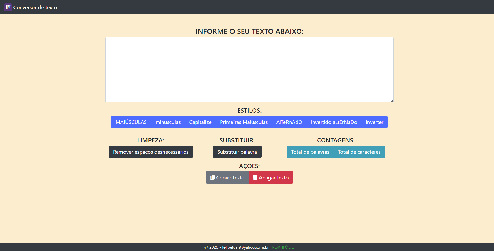

# Sistema para conversão de texto

Sistema desenvolvido para ajudar e auxiliar a tratar pequenos texto que estejam desformatados e com apenas alguns cliques você pode transformar seu texto.

---

## Opções de comandos

* Estilos de texto:
    * **Maiúsculo** - Transforma todo o texto para caixa alta.
    * **Minúsculo** - Transforma todo o texto para caixa baixa.
    * **Capitalize** - Transforma a primeira letra em caixa alta e o restante em caixa baixa (tipo construção de uma parágrafo).
    * **Primeiras Maiúsculas** - Transforma todas as primeiras letras de cada palavra em caixa alta e o restante da palavra em caixa baixa.
    * **Alternado** - Transforma o texto colocando uma letra em caixa alta e a próxima em caixa baixa e assim sucessivamente.
    * **Inverter Caixa** - Transforma de caixa alta para caixa baixa e de caixa baixa para caixa alta.
    * **Inverter texto** - Transforma o texto na ordem inversa.
* Limpeza do texto:
    * **Remover espaços desnecessários** - Remove os espaço desnecessários presentes no texto.
* Substituir:
    * **Substituir** - Trocar a ocorrência de uma palavra por outra.
* Contagens:
    * **Total de palavras** - Conta o total de palavras presente no texto informado.
    * **Total de caracteres** - Conta o total de caracteres (letras) presente no texto informado.
* Ações:
    * **Copiar texto** - faz um Ctrl + C. 
    * **Apagar texto** - Limpa a caixa de texto.

---

## Imagem do sistema

---

## Obrigado pela atenção:  Contato por email: felipekian@yahoo.com.br